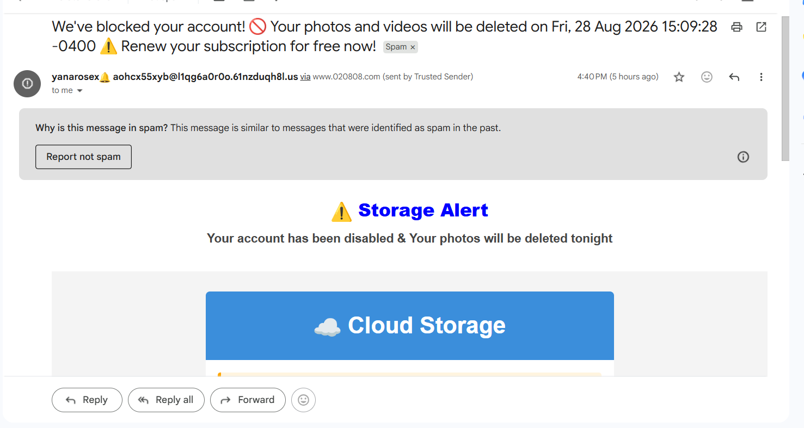
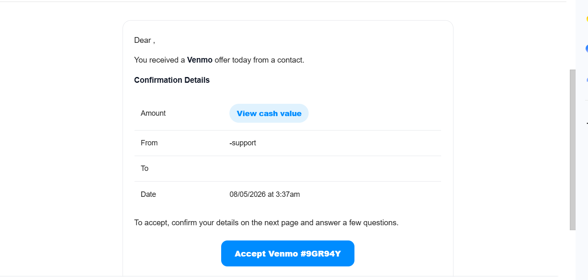

# Phishing Email Analysis

A beginner cybersecurity project analyzing two real suspicious emails from my inbox. The project focuses on identifying phishing indicators, explaining the social-engineering tactics behind each message, and choosing safe response and verification steps.

> **Scope:** This is a manual, defensive analysis based only on information visible in the emails. I did not click links, open attachments, visit suspicious pages, or interact with the senders.

## Project objectives

- Examine real-world phishing messages instead of relying only on simulated examples
- Identify sender, content, and behavioral warning signs
- Explain how attackers use emotion to influence decisions
- Recommend safe verification, reporting, and response actions
- Communicate security findings clearly to a nontechnical audience

## Case-study summary

| Case | Primary tactic | Key indicators | Risk | Safe response |
| --- | --- | --- | --- | --- |
| Fake cloud-storage warning | Fear and urgency | Unusual sender, unrelated domain, vague company name, deletion threat, confusing “free renewal” claim | A rushed user could follow the email's link and expose account or payment information | Open the real storage service separately, verify account status, report the email, and delete it |
| Fake Venmo offer | Reward and curiosity | Blank greeting, unexpected money, no amount, unclear sender, vague offer, buttons that hide the supposed value | A curious user could be redirected to a page requesting personal or account information | Check the Venmo app directly, avoid the email buttons, report the message, and delete it |

## Analysis method

For each email, I followed the same manual review process:

1. **Context:** Was I expecting the message or transaction?
2. **Sender:** Did the address and sending domain match the claimed organization?
3. **Language:** Did the message use urgency, fear, curiosity, or a reward?
4. **Request:** What action did the sender want me to take?
5. **Consistency:** Were the greeting, company identity, amount, and account details specific and logical?
6. **Verification:** Could I confirm the claim through an official app or website without using the email?
7. **Response:** What was the safest way to report and remove the message?

No single indicator proves that an email is malicious. My conclusions are based on the combination of the message's context, sender details, wording, and requested action.

## Evidence and findings

### Case 1: Fake cloud-storage warning

The email claims that my account was blocked and my photos would be deleted that night. It uses fear, a deadline, and the possibility of losing personal files to pressure the reader into acting quickly. The unusual sender address, unrelated sending domain, vague “Cloud Storage” identity, and Gmail spam warning increase the suspicion.

**Assessment:** Strong phishing/scam indicators. I would verify the account through the real storage app or an independently typed official website, then report and delete the email.

### Case 2: Fake Venmo offer

The message promises an unspecified Venmo offer but does not include my name, the payment amount, or a clearly identified sender. Buttons such as “View cash value” encourage the reader to click before receiving basic information. This combines curiosity with the promise of money.

**Assessment:** Strong phishing/scam indicators. I would check the Venmo app directly and avoid every button in the email. If no legitimate transaction appeared, I would report and delete the message.

For the indicator-by-indicator review, see the [full case-study analysis](real-phishing-examples.md).

## Skills demonstrated

- Phishing recognition and email triage fundamentals
- Social-engineering analysis
- Risk-based decision-making
- Safe out-of-band verification
- Security awareness and user education
- Evidence-based technical documentation
- Clear communication of findings and recommended actions

## Repository contents

| File | Purpose |
| --- | --- |
| [real-phishing-examples.md](real-phishing-examples.md) | Detailed analysis of both real suspicious emails |
| [phishing-awareness-guide.md](phishing-awareness-guide.md) | Beginner-friendly guide to phishing indicators and safe response steps |
| [reflection.md](reflection.md) | Lessons learned and how the project changed my approach to suspicious messages |
| [images/](images) | Redacted screenshots used as evidence |

## Limitations

This project does not include email-header inspection, URL reputation checks, attachment analysis, malware sandboxing, or forensic confirmation. Because I intentionally did not interact with the messages, I describe them as having **strong phishing/scam indicators** rather than claiming technical confirmation beyond the available evidence.

## Future improvements

As I build more technical experience, I plan to:

- Practice reading sanitized email headers and authentication results such as SPF, DKIM, and DMARC
- Compare visible link text with safely collected destination information in a controlled lab
- Create a repeatable phishing-triage checklist
- Add more sanitized examples covering impersonation, credential theft, and malicious attachments

## Main takeaway

Phishing emails can use opposite emotions while pursuing the same goal. One message threatens a loss; another promises a reward. In both cases, slowing down and verifying the claim through an independent, trusted channel prevents the email from controlling the decision.

## Safety and privacy

The screenshots do not display my personal email address or account information. I did not open the links, visit the linked pages, reply to the senders, or provide information.

## Reference

- [CISA — Recognize and Report Phishing](https://www.cisa.gov/secure-our-world/recognize-and-report-phishing)
